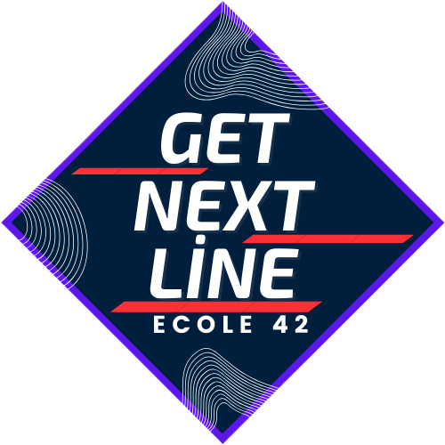

  
  <h2>42 GET NEXT LINE PROJECT</h2>
    
    
    
    
    
   
<h4>
    <a href="https://github.com/emre-mr246/42_ring1_get_next_line/issues">❔ Ask A Question</a>
   · 
    <a href="https://github.com/emre-mr246/42_ring1_get_next_line/issues">🪲 Report Bug</a>
   · 
    <a href="https://github.com/emre-mr246/42_ring1_get_next_line/issues">💬 Request Feature</a>
</h4>

## Introduction 🚀

This project is part of the coding curriculum of Ecole 42. The challenge to create a function in C that reads a line from a file descriptor. Sounds simple, but it's a powerful tool to understand file manipulation and memory handling in C programming.

## Objective 🎯

The get_next_line (GNL) project aims to enhance students' understanding of static variables in C, as well as to introduce file descriptors and how to read from them.  By the end of this project, you'll be able to read any file line by line, efficiently and effortlessly!

## Installation 🛠

To get started with the get_next_line project:

`$ git clone https://github.com/emre-mr246/get_next_line.git`

`$ cd get_next_line`

Make sure you have a C compiler installed (such as gcc) to compile the library.

## Usage 🔍
After cloning the project and navigating into the project directory, you can compile the project using:

`$gcc -Wall -Wextra -Werror -D BUFFER_SIZE=42 get_next_line_bonus.c get_next_line_utils_bonus.c main.c -o gnl`
Replace 42 with whatever buffer size you prefer. Then, run it using:

`$./gnl YOUR_FILE`

This will read from YOUR_FILE and print its contents line by line.

Note: Since printf has been added to libft, you can directly call it by linking with the libft library.
<a href="https://github.com/emre-mr246/42_ring0_libft"> Click here to go to the libft repository.</a>

